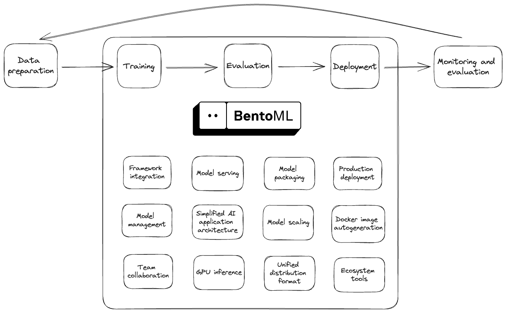

# BentoML-Implementation

BentoML is a framework for building reliable, scalable and cost-efficient AI applications.

## BentoML workflow

## Steps for Implementing bentoml

1. Define a model

2. Save a model

3. Create a Service

4. Build a Bento

5. Deploy a Bento

